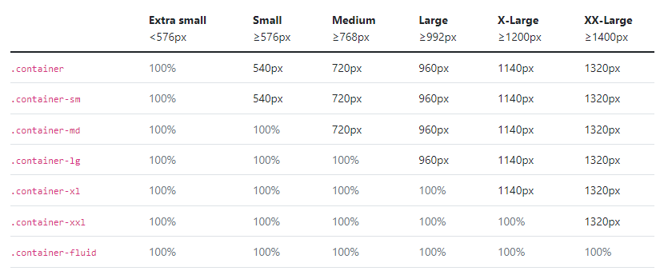
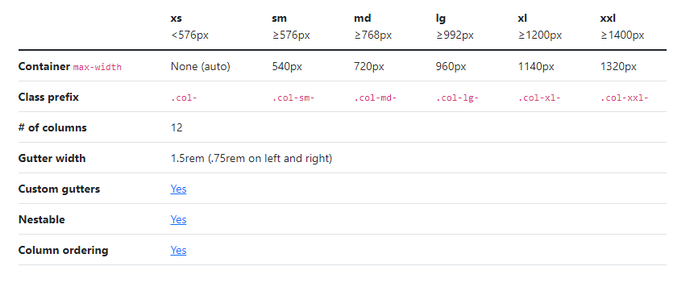
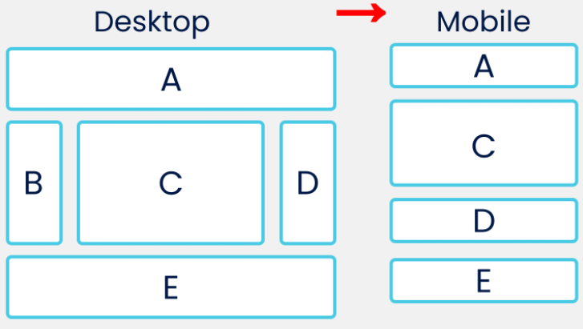
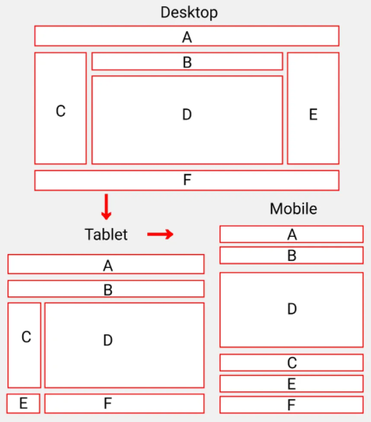

<style>
   section {
       font-size: 24px;
   }
</style>

# Bootstrap

---

## Contenidos

- [¿De qué va *Bootstrap* y como empiezo?](#de-que-va-bootstrap-y-como-empiezo) 🤔
- [Diseñando con *Bootstrap* y sus 12 columnas](#diseñando-con-bootstrap-y-sus-12-columnas)
- [Comodidades *Bootstrap*](#comodidades-bootstrap)
- ...y no pueden faltar los Formularios :unamused:
- ¿Algunos componentes más? :pray:

---

## ¿De qué va *Bootstrap* y como empiezo?

[Bootstrap :link:](https://getbootstrap.com/) se autodefine como un framework CSS que permite construir con facilidad sitios web responsivos y orientados a dispositivos móviles.

Nosotros lo definiremos como una hoja de estilos (escrita es *Sass*) muy bien pensada que nos ahorra trabajo y también nos trae algunos componentes muy bonitos (*popovers*, *toast*, *tooltips*...) 🥳

---

### ¿Cómo nos ponemos en marcha con *Bootstrap*?


Muy sencillo, añadimos el siguiente `<link>` a nuestro `<head>`, al principio de de cualquier otra hoja de estilo

```html
<link href="https://cdn.jsdelivr.net/npm/bootstrap@5.1.3/dist/css/bootstrap.min.css" 
      rel="stylesheet" 
      integrity="sha384-1BmE4kWBq78iYhFldvKuhfTAU6auU8tT94WrHftjDbrCEXSU1oBoqyl2QvZ6jIW3" 
      crossorigin="anonymous">
```

Con :arrow_up: tendríamos lo básico para tirar, salvo algunos componentes que requieren *js*, y en caso de usarlos, añadiremos al final del `<body>`

```html
<script src="https://cdn.jsdelivr.net/npm/bootstrap@5.1.3/dist/js/bootstrap.bundle.min.js" 
        integrity="sha384-ka7Sk0Gln4gmtz2MlQnikT1wXgYsOg+OMhuP+IlRH9sENBO0LRn5q+8nbTov4+1p" 
        crossorigin="anonymous"></script>
```

y ya esta 🥳

---

### Algo importante sobre responsividad

Como decíamos al principio, *Bootstrap* se centra en el diseño responsivo y *mobile-first* y con este objetivo, establece unas anchuras fijas o *breakpoints* que disparan cambios en nuestro diseño a través de las clases con las que marcamos los elementos de nuestra plantilla. Por aquí ⬇️ la tabla resumen de los *breakpoints*

---

|Breakpoint|Class infix|Dimensions|
|--- |--- |--- |
|X-Small|None|<576px|
|Small|sm|≥576px|
|Medium|md|≥768px|
|Large|lg|≥992px|
|Extra large|xl|≥1200px|
|Extra extra large|xxl|≥1400px|

---

Como podréis imaginar 🤓, estos *breakpoints* estan implementados en *Sass*

```scss
// No media query necessary for xs breakpoint as it's effectively `@media (max-width: 0) { ... }`
@include media-breakpoint-down(sm) { ... }
@include media-breakpoint-down(md) { ... }
@include media-breakpoint-down(lg) { ... }
@include media-breakpoint-down(xl) { ... }
@include media-breakpoint-down(xxl) { ... }

// Example: Style from medium breakpoint and down
@include media-breakpoint-down(md) {
  .custom-class {
    display: block;
  }
}
```

---

 y compilan a su respectiva `@media` query

 ```css
 // X-Small devices (portrait phones, less than 576px)
// No media query for `xs` since this is the default in Bootstrap

// Small devices (landscape phones, 576px and up)
@media (min-width: 576px) { ... }

// Medium devices (tablets, 768px and up)
@media (min-width: 768px) { ... }

// Large devices (desktops, 992px and up)
@media (min-width: 992px) { ... }

// X-Large devices (large desktops, 1200px and up)
@media (min-width: 1200px) { ... }

// XX-Large devices (larger desktops, 1400px and up)
@media (min-width: 1400px) { ... } 
 ```

 pero para nosotros esto es transparente 😌

 ---

 ## Diseñando con *Bootstrap* y sus 12 columnas

 Vale 👌, como empiezo a utilizar *Bootstrap*, ¿cual es su 🍞 and 🧈?

 ---

 ### Containers

 Pues eso, el bloque fundamental de organización de contenido en *Bootstrap* son sus *containers*. Os explico muy rápido ⚡ cómo funcionan

 > Metéis en un `<div class=container>` lo que queráis y ya :sunglasses:

 ...bueno, no es tan fácil, me dejo algún detalle ⬇️

 ---

 Hay 3 tipos de *containers*

- `.container`, que fija un `max-width` para cada *breakpoint*
- `.container-fluid`, que fija `width: 100%` para todos los *breakpoints*
- `.container-{breakpoint}`, que hace `width: 100%` hasta el *breakpoint* especificado

---

Aqui tenéis la tabla resumen



---

### Grid

Y ahora el *grid* de *Bootstrap*, que se explica mejor con un ejemplo

```html
<div class="container">
  <div class="row">
    <div class="col">
      Column
    </div>
    <div class="col">
      Column
    </div>
    <div class="col">
      Column
    </div>
  </div>
</div>
```

--- 

como 👀, se basa en 3 elementos

- Un `<div class="container"></div>` que aloja todo el *layout*
- Un `<div class="row"></div>` por cada fila
- Un `<div class="col"></div>` por cada columna

---

¿Y como incorporamos responsividad al *grid*? Otra tablita 😅



---

Un dato importante sobre el grid de *Bootstrap* es que divide el *layout* en 12 columnas (si os fijáis 👀, todos los anchos de los *breakpoints* son divisibles entre 12)

Esto nos permite personalizar el ancho que ocupa cada *item* dentro de su fila. Ejemplo ⬇️

---

```html
<div class="container">
  <div class="row">
    <div class="col">
      1 of 3
    </div>
    <div class="col-6">
      2 of 3 (wider)
    </div>
    <div class="col">
      3 of 3
    </div>
  </div>
  <div class="row">
    <div class="col">
      1 of 3
    </div>
    <div class="col-5">
      2 of 3 (wider)
    </div>
    <div class="col">
      3 of 3
    </div>
  </div>
</div>
```

Como véis, fijamos el ancho de la 2da columna de la 1ra fila a 6 con `class="col-6"`, mientras que la 1ra y la 3ra ocuparan 3 y 3.

---

También podemos hacer que el ancho de cada *item* se ajuste a su contenido

```html
<div class="container">
  <div class="row justify-content-md-center">
    <div class="col col-lg-2">
      1 of 3
    </div>
    <div class="col-md-auto">
      Variable width content
    </div>
    <div class="col col-lg-2">
      3 of 3
    </div>
  </div>
  <div class="row">
    <div class="col">
      1 of 3
    </div>
    <div class="col-md-auto">
      Variable width content
    </div>
    <div class="col col-lg-2">
      3 of 3
    </div>
  </div>
</div>
```

---

Como puntos destacables del código de arriba

- `<div class="col-md-auto">` - El ancho de la columna se ajusta al tamaño de su contenido
- `<div class="row justify-content-md-center">` - Centra todas las columnas de la fila para pantallas con anchos >= `md`
- `<div class="col col-lg-2">` - El *item* ocupa 2 columnas para pantallas con anchos >= `lg`

---

Si queremos personalizar el tamaño de los espacios entre items del *grid* (*gutters*) lo podemos hacer así

```html
<div class="container px-4">
  <div class="row gx-5">
    <div class="col">
     <div class="p-3 border bg-light">Custom column padding</div>
    </div>
    <div class="col">
      <div class="p-3 border bg-light">Custom column padding</div>
    </div>
  </div>
</div>
```

---

- `<div class="container px-4">` - Establece el padding horizontal del container a 4 (ya vemos esto mas adelante)
- `<div class="row gx-5">` - Espaciado horizontal entre items con un valor de 5
- `<div class="p-3 border bg-light">` - Padding a 3, bordes y color de fondo gris claro

---

## Comodidades Bootstrap

*Bootstrap* provee de una serie de clases de utilidad (*a.k.a* comodidades). Vamos a verlas 👀

---

### *Background*

Para el color tenemos estas clases (también os pongo las de texto)

```html
<div class="p-3 mb-2 bg-primary text-white">.bg-primary</div>
<div class="p-3 mb-2 bg-secondary text-white">.bg-secondary</div>
<div class="p-3 mb-2 bg-success text-white">.bg-success</div>
<div class="p-3 mb-2 bg-danger text-white">.bg-danger</div>
<div class="p-3 mb-2 bg-warning text-dark">.bg-warning</div>
<div class="p-3 mb-2 bg-info text-dark">.bg-info</div>
<div class="p-3 mb-2 bg-light text-dark">.bg-light</div>
<div class="p-3 mb-2 bg-dark text-white">.bg-dark</div>
<div class="p-3 mb-2 bg-body text-dark">.bg-body</div>
<div class="p-3 mb-2 bg-white text-dark">.bg-white</div>
<div class="p-3 mb-2 bg-transparent text-dark">.bg-transparent</div>
```

y si queréis un gradiente basta con añadir `bg-gradient`, por ejemplo

```html
<div class="p-3 mb-2 bg-primary bg-gradient text-white">.bg-primary</div>
```

---

### *Borders*

Y a riesgo de ponerme borde 😅, podemos añadir bordes ➕

```html
<span class="border"></span>
<span class="border-top"></span>
<span class="border-end"></span>
<span class="border-bottom"></span>
<span class="border-start"></span>
```

y quitarlos ➖

```html
<span class="border-0"></span>
<span class="border-top-0"></span>
<span class="border-end-0"></span>
<span class="border-bottom-0"></span>
<span class="border-start-0"></span>
```

---

Cambiar su color 🌈

```html
<span class="border border-primary"></span>
<span class="border border-secondary"></span>
<span class="border border-success"></span>
<span class="border border-danger"></span>
<span class="border border-warning"></span>
<span class="border border-info"></span>
<span class="border border-light"></span>
<span class="border border-dark"></span>
<span class="border border-white"></span>
```

y su grosor

```html
<span class="border border-1"></span>
<span class="border border-2"></span>
<span class="border border-3"></span>
<span class="border border-4"></span>
<span class="border border-5"></span>
```

---

... y también redondear los vertices ⚪

```html


```

...utilizando mayor o menor radio de redondeo

```html


```

---

### *Display*

*Bootstrap* también nos facilita clases para la propiedad `display`

```html
<div class="d-inline p-2 bg-primary text-white">d-inline</div>
<span class="d-block p-2 bg-dark text-white">d-inline</span>
```

- `d-inline` equivale a `display: inline` para el elemento de bloque `<div>`
- `d-block` equivale a `display: block` para el elemento en linea `<span>`

---

La sintaxis generalizada para esta clase es 

- `d-{valor}` para pantallas *xs*
- `d-{breakpoint}-{valor} ` para el resto

Y `valor` puede ser `none, inline, inline-block, block, grid, table, table-cell, table-row, flex, inline-flex`

---

Esta clase resulta muy útil para esconder cosas, p. ej.

```css
<div class="d-lg-none">hide on lg and wider screens</div>
<div class="d-none d-lg-block">hide on screens smaller than lg</div>
```

- `<div class="d-lg-none">` que escondería el `<div>` en dispositivos con pantallas >= `lg`
- `<div class="d-none d-lg-block">` que oculta el `<div>` en dispositivos pequeños (`xs`)

---

### *Flex*

Y si amigos, *Bootstrap* también tiene cosas para nosotros en lo que a *Flexbox* se refiere. Y no me refiero solo a `display: flex` como se puede 👀 arriba, sino a todo lo demás ⬇️

---

#### *Direction*

P. ej.

```html
<div class="d-flex flex-row bd-highlight mb-3">
  <div class="p-2 bd-highlight">Flex item 1</div>
  <div class="p-2 bd-highlight">Flex item 2</div>
  <div class="p-2 bd-highlight">Flex item 3</div>
</div>
<div class="d-flex flex-row-reverse bd-highlight">
  <div class="p-2 bd-highlight">Flex item 1</div>
  <div class="p-2 bd-highlight">Flex item 2</div>
  <div class="p-2 bd-highlight">Flex item 3</div>
</div>
```

- `<div class="d-flex flex-row bd-highlight mb-3">` que marca el `<div>` como *flex container*, establece `flex-direction: row` y `margin-bottom` a 3
- `<div class="d-flex flex-row-reverse bd-highlight">` que marca el `<div>` como *flex container* y establece `flex-direction: row-reverse`

---

#### Wrap

Otra de las propiedades fundamentales

```html
<div class="d-flex flex-nowrap"> No Wrap </div>
<div class="d-flex flex-wrap"> Wrap </div>
<div class="d-flex flex-wrap-reverse"> Wrap reverse </div>
```

---

#### *Justify content* y *Align items*

Recordad que *justify* es para organizar los *items* respecto al eje horizontal y *align* respecto al vertical.

```html
<div class="d-flex justify-content-start">...</div>
<div class="d-flex justify-content-end">...</div>
<div class="d-flex justify-content-center">...</div>
<div class="d-flex justify-content-between">...</div>
<div class="d-flex justify-content-around">...</div>

<div class="d-flex align-items-start">...</div>
<div class="d-flex align-items-end">...</div>
<div class="d-flex align-items-center">...</div>
<div class="d-flex align-items-baseline">...</div>
<div class="d-flex align-items-stretch">...</div>
```

---

#### *Order*

Y poniendo un poco de orden 

```html
<div class="d-flex flex-nowrap">
  <div class="order-3 p-2">First flex item</div>
  <div class="order-2 p-2">Second flex item</div>
  <div class="order-1 p-2">Third flex item</div>
</div>
```

Tiene alguna clase más que aplica a los *flex items* pero permitidme ser perezoso y remitiros a la [documentación :link:](https://getbootstrap.com/docs/4.0/utilities/flex/) ya que son menos usadas.

---

### *Sizing*

Si queremos actuar sobre anchos y altos de elementos de forma fácil (👀👀 en %), podemos usar las siguientes clases

```html
<div class="w-25 p-3" style="background-color: #eee;">Width 25%</div>
<div class="w-50 p-3" style="background-color: #eee;">Width 50%</div>
<div class="h-75 p-3" style="background-color: #eee;">Height 75%</div>
<div class="h-100 p-3" style="background-color: #eee;">Height 100%</div>
```

---

También tenemos un *shortcut* para `max-width` y `max-height`

```html


```

---

### Dame un poco de *spacing* por favor...

*A.k.a* vamos a *ñapearlo* todo con `margin` y `padding`. 

Funciona de forma equivalente a otras clases anteriores con un añadido ⬇️

- `{property}{sides}-{size}` para dispositivos `xs`
- `{property}{sides}-{breakpoint}-{size}` para el resto
  
donde

- `property` puede ser 
  - `m` para margenes
  - `p` para *padding*

---

- `sides` toma valores entre los siguientes
  - `t` para `top`
  - `b` para `bottom`
  - `l` a.k.a `left`
  - `r` equivale a `right`
  - `x` equivale a `left` y `right`
  - `y` se refiere a `top` y `bottom`
  - Si va vacio aplica a los 4 lados

---

y finalmente

- `size` que puede valer
  - `0` - que eliminaría el margen o *padding*
  - `1` - `$spacer` * 0.25
  - `2` - `$spacer` * 0.5
  - `3` - `$spacer`
  - `4` - `$spacer` * 1.5
  - `5` - `$spacer` * 3
  - `auto` - `margin: auto`

Aclarar que `$spacer` es una variable definida en el *Sass* de *Bootstrap* que vale *16px*

---

y un ejemplo de las clases antes de compilar

```scss
.mt-0 {
  margin-top: 0 !important;
}

.ml-1 {
  margin-left: ($spacer * .25) !important;
}

.px-2 {
  padding-left: ($spacer * .5) !important;
  padding-right: ($spacer * .5) !important;
}

.p-3 {
  padding: $spacer !important;
}
```

---

### *Bootstrap* también trae magia para los que tienen algo que ocultar

Si queremos que algo no se vea basta con hacer

```html
<div class="visible">...</div>
<div class="invisible">...</div>
```

pero cuidado ⚠️, el elemento sigue ahí, ocupando espacio como Harry Potter :mage_man:, sólo que no lo veis. No equivale a  `display: none`.

---


## Actividad 1

Replica el *layout* del ejercicio 2 de la tarea entregable 2 usando *Bootstrap*



---


## Actividad 1

Replica el *layout* del ejercicio 3 de la tarea entregable 2 usando *Bootstrap*




